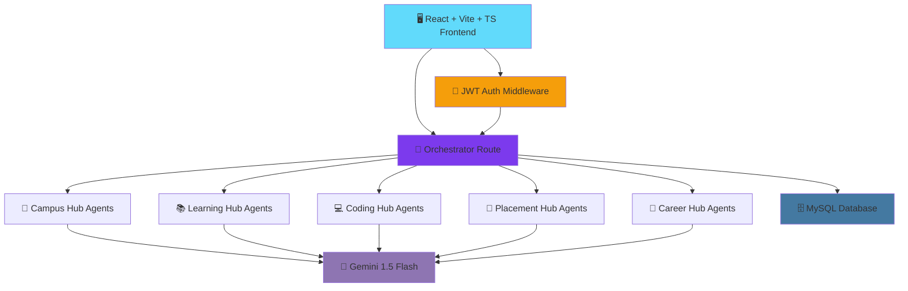

```
███╗   ██╗███████╗██████╗  ██████╗ ██╗  ██╗     █████╗ ██╗
████╗  ██║██╔════╝██╔══██╗██╔═══██╗╚██╗██╔╝    ██╔══██╗██║
██╔██╗ ██║█████╗  ██████╔╝██║   ██║ ╚███╔╝     ███████║██║
██║╚██╗██║██╔══╝  ██╔══██╗██║   ██║ ██╔██╗     ██╔══██║██║
██║ ╚████║███████╗██║  ██║╚██████╔╝██╔╝ ██╗    ██║  ██║██║
╚═╝  ╚═══╝╚══════╝╚═╝  ╚═╝ ╚═════╝ ╚═╝  ╚═╝    ╚═╝  ╚═╝╚═╝
```

## NEROX AI 🤖

### Autonomous Campus Intelligence & Placement Operating System

[](https://react.dev)
[](https://vitejs.dev)
[](https://www.typescriptlang.org)
[](https://nodejs.org)
[](https://expressjs.com)
[](https://www.mysql.com)
[](https://ai.google.dev)
[](https://jwt.io)

> A **Multi-Agent AI Operating System** that helps students throughout their complete academic and placement journey — from daily campus queries to full placement readiness.
>
> *NEROX AI — Not a chatbot. Not an ERP. An AI Operating System for Students.*

[🚀 Quick Start](#-quick-start) · [🤖 AI Agents](#-ai-agents-20-total) · [🏗️ Architecture](#%EF%B8%8F-architecture) · [📡 API](#-api-endpoints) · [🎨 Design](#-design-system)

---

## 📑 Table of Contents

| Core Sections | Technical Deep Dives | Resources |
|---|---|---|
| [🎯 Key Features](#-key-features) | [🏗️ Architecture](#%EF%B8%8F-architecture) | [🚀 Quick Start](#-quick-start) |
| [🆚 Why NEROX AI?](#-why-nerox-ai) | [🤖 Agent Orchestration](#-agent-orchestration) | [🔑 Environment Variables](#-environment-variables) |
| [🤖 AI Agents (20 Total)](#-ai-agents-20-total) | [📡 API Endpoints](#-api-endpoints) | [🗺️ Roadmap](#%EF%B8%8F-roadmap) |
| [🎨 Design System](#-design-system) | | [🏆 Built With](#-built-with) |

---

## 🎯 Key Features

| Feature | Description |
|---|---|
| 🏫 **Campus Hub** | Attendance, fees, timetable, library, and events — all in one AI-answered feed |
| 📚 **Smart Learning Hub** | Concept tutoring, PDF-to-notes/flashcards, quiz generation, revision planning |
| 💻 **Coding Hub** | AI mentor for debugging, optimization, and adaptive Java/Python/SQL tests |
| 🎯 **Placement Intelligence Hub** | Company-specific readiness scoring, test generation, GD coaching, 30/60/90-day strategy |
| 🧭 **Career Hub** | Career path advice, certification suggestions, skill-gap analysis vs target role |
| 🔀 **Orchestrator Agent** | Routes each student query to the right specialized agent automatically |
| 🌌 **Glassmorphic Dark UI** | Aurora-gradient, always-dark interface built for long study sessions |

---

## 🆚 Why NEROX AI?

| Capability | Typical Campus/Placement Portal | **NEROX AI** |
|---|---|---|
| Interaction Style | Static forms & dashboards | 🤖 20 conversational AI agents |
| Learning Support | None or generic | 📚 PDF → summary, flashcards, mind maps |
| Placement Prep | Generic mock tests | 🎯 Company-specific readiness + strategy plans |
| Coding Practice | Fixed problem sets | 💻 Adaptive tests + AI debugging mentor |
| Routing Logic | Manual navigation | 🔀 Orchestrator auto-routes to the right agent |
| Design | Standard admin UI | 🌌 Glassmorphism + Aurora gradient theme |

---

## 🏗️ Architecture



### 📁 Project Structure

```
nerox-ai/
├── client/                    React + Vite + TypeScript frontend
│   ├── src/
│   │   ├── components/        Reusable UI components
│   │   │   ├── layout/        Sidebar, Navbar, PageWrapper
│   │   │   └── ui/            GlassCard, Button, Charts, etc.
│   │   ├── context/           Auth, Theme, Agent contexts
│   │   ├── pages/             10 full pages
│   │   └── api/                Axios API modules
│   └── ...
└── server/                    Node.js + Express backend
    ├── src/
    │   ├── config/             DB + Gemini config
    │   ├── controllers/        10 controller modules
    │   ├── services/           20 AI agent services
    │   ├── routes/             10 route modules
    │   ├── middleware/         Auth, upload, validate
    │   └── utils/              Response helpers
    └── database/
        └── schema.sql          MySQL schema (13 tables)
```

---

## 🔀 Agent Orchestration

```
┌─────────────────────────────────────────────────────────────────┐
│                    🎓 STUDENT QUERY                               │
│         "Generate a 5-mark quiz on OS process scheduling"        │
└────────────────────────────┬─────────────────────────────────────┘
                             │
          ╔══════════════════▼═══════════════════════════════════╗
          ║      🔐  AUTH MIDDLEWARE                              ║
          ║            JWT verification                          ║
          ╚═══════════════╤═══════════════════════════════════════╝
                          │
          ╔═══════════════▼═══════════════════════════════════════╗
          ║      🔀  ORCHESTRATOR ROUTE                           ║
          ║          POST /api/orchestrator/route                ║
          ║                                                      ║
          ║  Intent ─────────────► Smart Learning Hub             ║
          ║  Agent ──────────────► Quiz Generator                ║
          ╚═══════════════╤═══════════════════════════════════════╝
                          │
          ╔═══════════════▼═══════════════════════════════════════╗
          ║      🤖  QUIZ GENERATOR AGENT (Gemini 1.5 Flash)      ║
          ║                                                      ║
          ║  📋 Input: topic + difficulty + question format       ║
          ║  ✅ Output: MCQ / 2M / 5M / 10M / Viva questions       ║
          ╚═══════════════╤═══════════════════════════════════════╝
                          │
                          ▼
                 🗄️ Logged to MySQL for analytics + history
```

---

## 🤖 AI Agents (20 Total)

### Module 1 · 🏫 Campus Hub

| Agent | Function |
|---|---|
| Helpdesk Agent | Attendance, fees, exams, college FAQ |
| Timetable Agent | Today's classes, exam schedule |
| Library Agent | Book search, recommendations, summaries |
| Events Agent | Hackathons, workshops, registration |

### Module 2 · 📚 Smart Learning Hub

| Agent | Function |
|---|---|
| Smart Tutor | Concept explanations, examples, notes |
| Notes Intelligence | PDF → Summary, Flashcards, Mind Map |
| Quiz Generator | MCQ, 2M, 5M, 10M, Viva questions |
| Revision Planner | Daily/weekly/exam study plans |

### Module 3 · 💻 Coding Hub

| Agent | Function |
|---|---|
| Coding Mentor | Explain, debug, optimize, complexity |
| Debug Agent | Error detection, fix, better code |
| Coding Test Agent | Adaptive Java/Python/SQL tests |

### Module 4 · 🎯 Placement Intelligence Hub

| Agent | Function |
|---|---|
| Company Readiness | Company-specific readiness score |
| Company Explorer | Company profiles, process, salary |
| Test Generator | Company-specific full test papers |
| Coding Evaluator | Performance analysis, suggestions |
| GD Coach | Topic generation, evaluation |
| Placement Analytics | Comprehensive placement dashboard |
| Strategy Agent | 30/60/90-day preparation plans |
| Daily Mission | Daily coding/aptitude challenges |

### Module 5 · 🧭 Career Hub

| Agent | Function |
|---|---|
| Career Advisor | Paths, certifications, internships |
| Skill Gap Agent | Current vs target role gap analysis |

---

## 🎨 Design System

| Aspect | Choice |
|---|---|
| Theme | Dark (always-on) |
| Primary Colors | Indigo `#6366f1` · Violet `#8b5cf6` · Cyan `#06b6d4` |
| Style | Glassmorphism + Aurora gradients |
| Typography | Space Grotesk + Inter |
| Animations | Framer Motion + CSS keyframes |
| Charts | Recharts (dark theme) |

---

## 📡 API Endpoints

```
POST /api/auth/register
POST /api/auth/login
GET  /api/auth/me

GET  /api/profile
PUT  /api/profile
POST /api/profile/skill
DELETE /api/profile/skill/:id

POST /api/campus/helpdesk
POST /api/campus/timetable
POST /api/campus/library
POST /api/campus/events

POST /api/learning/tutor
POST /api/learning/notes
POST /api/learning/quiz
POST /api/learning/revision

POST /api/coding/mentor
POST /api/coding/debug
POST /api/coding/test

POST /api/placement/readiness
POST /api/placement/company
POST /api/placement/test
POST /api/placement/gd
GET  /api/placement/analytics
POST /api/placement/strategy

POST /api/career/advise
POST /api/career/skill-gap

GET  /api/analytics/success-score
GET  /api/analytics/history

GET  /api/mission/daily
POST /api/mission/complete
GET  /api/mission/points

POST /api/orchestrator/route
```

---

## 🚀 Quick Start

### Prerequisites
- Node.js 18+
- MySQL 8+
- Google Gemini API Key

### 1 · Clone & Setup

```bash
git clone https://github.com/HareshK-14/NEROX-AI.git
cd NEROX-AI

# Setup database
mysql -u root -p < server/database/schema.sql

# Setup backend
cd server
cp .env.example .env
# Edit .env with your MySQL credentials and Gemini API key
npm install
npm run dev

# Setup frontend (new terminal)
cd client
npm install
npm run dev
```

### 2 · Get Gemini API Key
1. Visit https://makersuite.google.com/app/apikey
2. Create a new API key
3. Add it to `server/.env` as `GEMINI_API_KEY`

---

## 🔑 Environment Variables

**`server/.env`**
```
PORT=5000
DB_HOST=localhost
DB_USER=root
DB_PASSWORD=your_password
DB_NAME=nerox_ai
JWT_SECRET=your_super_secret_jwt_key_here
JWT_EXPIRES_IN=7d
GEMINI_API_KEY=your_gemini_api_key_here
CLIENT_URL=http://localhost:5173
UPLOAD_DIR=uploads
```

> ⚠️ Never commit a real `.env` file. Keep `GEMINI_API_KEY` and `JWT_SECRET` out of version control — `.env` should stay in `.gitignore`.

---

## 🗺️ Roadmap

| Stage | Status | Description |
|---|---|---|
| 1 | ✅ Done | MySQL schema (13 tables) + auth (JWT) |
| 2 | ✅ Done | 20 AI agents across 5 hubs (Gemini 1.5 Flash) |
| 3 | ✅ Done | Orchestrator routing + React/Vite/TS frontend |
| 4 | ✅ Done | Glassmorphic dark UI + Recharts analytics |
| 5 | 🔲 Planned | Deployment (Docker/CI) + production Gemini rate limiting |
| 6 | 🔲 Planned | Mobile-responsive polish + notification system |

---

## 🏆 Built With

| Layer | Technology |
|---|---|
| Frontend | React 18, Vite, TypeScript, Tailwind CSS, Framer Motion, Recharts, Lucide React |
| Backend | Node.js, Express.js, MySQL2, JWT, bcryptjs, Multer |
| AI | Google Gemini 1.5 Flash API (20 dedicated agents) |
| Database | MySQL 8 |

---

## 👤 Author

**Haresh K.**
B.Tech Information Technology, V.S.B. Engineering College
[GitHub](https://github.com/HareshK-14)

---

### ⭐ Star this repo if you find it useful!

*NEROX AI — Not a chatbot. Not an ERP. An AI Operating System for Students.*
